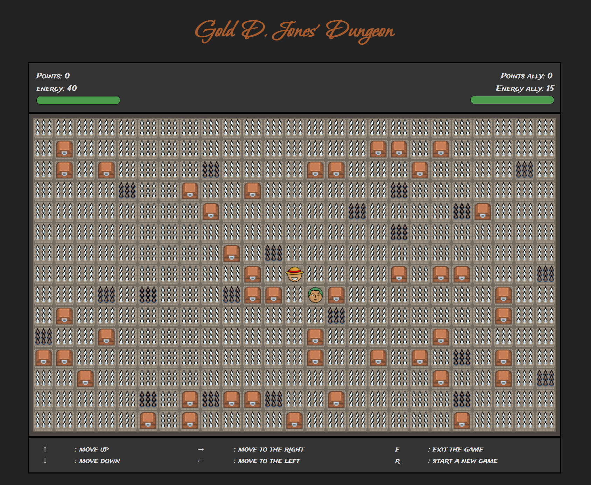

# Gold D Jones' Dungeon
The game consists of a hero that moves around a dungeon trying to collect as many points as possible from treasures while limiting the amount of traps he needs to step on (these will reduce his energy and points). He also has a sidekick that moves in the opposite direction that can transfer his points to the hero whenever they meet.

# Supported npm commands
- npm run start (start the web server)
- npm run format (check code formatting issues)
- npm run format:fix (attempt to fix formatting issues)
- npm run lint (check code for errors and bugs)
- npm run lint:fix (attempt to fix those errors and bugs)
- npm run test (run tests)

# Screenshots
## Intro

## How to play

## Gameplay
